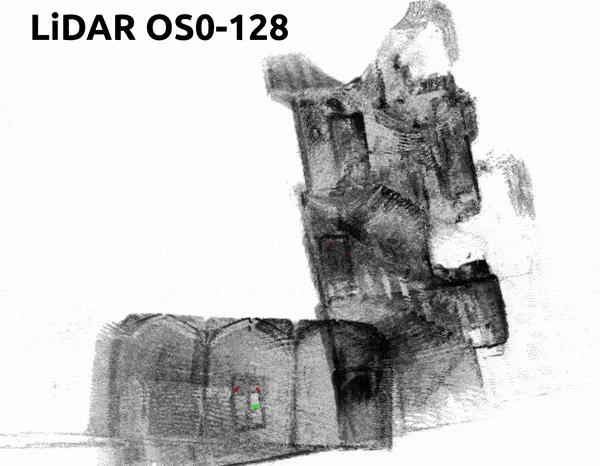

<h1 align="center">Bundle Adjusted Multi-cue Direct SLAM</h1>

  
   

<h3 align="center"> Our code will be published <a href="https://github.com/digiamm/ba_md_slam">here</a></h3>

We will soon release an <b>updated</b> version of <a href="https://github.com/digiamm/md_slam">MD-SLAM</a> (around 30Hz for RGB-D and 50Hz for LiDAR) and our <b>new photometric BA</b> refinement, both in CUDA. A draft of our work including supplementary material is available here and from <a href="https://arxiv.org/abs/2303.16878">arXiv</a>.

